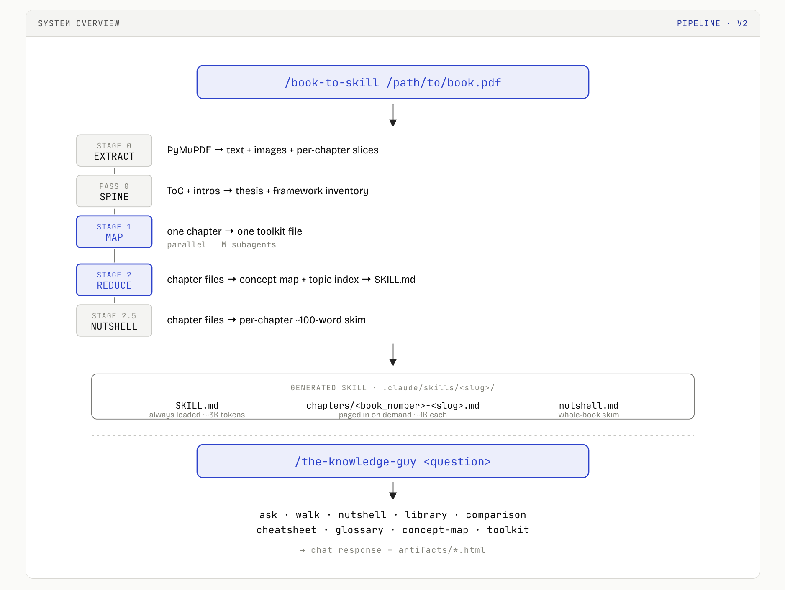

# The Knowledge Guy

> Turn any PDF or EPUB into a structured Claude Code skill —
> then ask your whole bookshelf a single question.

<p align="center">
  
</p>

*From a PDF on disk to a queryable knowledge skill in one command;
from a question to a cross-domain answer in another.*

---

## What this is

A long book is 400K+ tokens; you forget the middle by the end; asking
a question that spans three books is impossible. Existing tools
either stuff everything into context (expensive, forgetful) or
hand-write summaries (lossy, immediately stale).

`/book-to-skill` is a **map-reduce ingest pipeline** that turns a
PDF or EPUB into a two-tier Claude Code skill: an always-loaded
concept map (~3K tokens — thesis, 6-10 load-bearing frameworks,
chapter and topic indexes) plus on-demand chapter toolkits (~1K
tokens each — frameworks, techniques, anti-patterns, worked
examples). A 600-page book becomes a skill that costs a few thousand
tokens to consult instead of four hundred.

`/the-knowledge-guy` is the **router and interactive teacher** across
every installed skill. It auto-discovers skills from the filesystem
at every invocation, routes any question to every plausibly relevant
book in parallel, and synthesises one answer with inline citations.
It can teach a topic step by step with quizzes and resumable progress
— and it can turn a chapter into an interactive **learn-by-doing**
website: theory with manipulable SVG illustrations, auto-checked
quizzes, in-browser code labs, and open tasks it grades against a
rubric.

The architectural rule that holds it together: **plumbing in Python,
intelligence in Claude.** `extract.py` does mechanical PDF → text +
slices + image manifest, and that is *all* it does. Every act of
understanding — framework extraction, concept mapping, synthesis,
quiz authoring — is an LLM call.

Both skills follow Anthropic's `SKILL.md` open standard — consumed
natively by Claude Code, Claude Desktop, claude.ai, the Claude API,
OpenAI Codex CLI, and GitHub Copilot. See *Install on your platform*
below.

## Quick start

```bash
/book-to-skill /path/to/book.pdf                                  # ingest  (add --course → complete coverage + practice)
/the-knowledge-guy what do my books say about margin of safety?   # ask
/the-knowledge-guy walk me through Kerberos                       # tutor
/the-knowledge-guy course <skill-slug>                            # learn by doing
/the-knowledge-guy nutshell <skill-slug>                          # skim
/the-knowledge-guy resume                                         # resume
```

Every invocation also writes a self-contained HTML artifact to
`artifacts/`. Course pages are interactive — they run in the browser.

## The system, in two pieces

### `/book-to-skill` — the ingest pipeline

Map-reduce in six stages (the sixth, **Stage 3 PRACTICE**, is opt-in),
plus an opt-in per-chapter **coverage audit**. What's worth knowing:

- **Two-tier output.** `SKILL.md` is always loaded;
  `chapters/<book_number>-<slug>.md` is paged in on demand. The
  tier-1 file is front-loaded so compaction keeps the start safely.
- **`book_number` is the canonical chapter label** — `ch07`, `intro`,
  `appendix-a`, `part-1`, `fm`, `bm`. The book's own chapter numbers,
  never extraction order. The manifest also carries an internal
  `index` — never user-facing.
- **`schema_version: 2`** plus three idempotent helper scripts so
  legacy skills upgrade in place without re-extracting.
- **Resume is filesystem-driven.** Re-running on a partial run is
  always safe; chapter files in `chapters/` are the checkpoint.
- **`raw/` stays with the skill** — full text, slices, images,
  metadata, Pass-0 spine. Re-extracting one chapter never re-runs
  Stage 0.
- **Seven genre profiles** (technical / vuln-hunting / financial /
  scientific / productivity / narrative non-fiction / general) tune
  chunk boundaries, the chapter schema, and the reduce emphasis.
- **Complete-coverage mode (opt-in)** replaces the default dense, capped
  toolkits with capturing *every* load-bearing element in every chapter,
  then runs a per-chapter **coverage audit** and re-runs any chapter with
  gaps until it clears a 95% gate — so nothing is silently dropped. (CS:APP
  was ingested this way: 130 sections, every one audited to 100%.)
- **Stage 3 PRACTICE (opt-in)** turns each chapter into a practice set —
  it extracts the book's own exercises, generates new ones, and for
  cyber/technical chapters can web-research realistic labs. The output
  (`practice/<book_number>-<slug>.json`) is what `/the-knowledge-guy
  course` renders as an interactive learn-by-doing site. Best for
  technical / textbook / vuln-hunting books.
- **Options — flags or interactive.** Pass `--complete` (full coverage),
  `--practice` (Stage 3), `--course` (both → course-ready), or
  `--regenerate` (rebuild an existing skill) — or omit them and
  book-to-skill prompts for each *with a cost estimate before spending*.
  The same flags pass through the router: `/the-knowledge-guy <path>.pdf --course`.

### `/the-knowledge-guy` — the router + teacher

Auto-discovery, no registry. Reads `.claude/skills/*/SKILL.md`
frontmatter at every invocation; drop a skill in, the router picks it
up on the next call. Excludes itself and `book-to-skill` from
routing, every time.

| Mode | What it does | Trigger |
| ---- | ------------ | ------- |
| **ask** | Cross-domain synthesis essay with inline citations | open-ended question |
| **walk** | Interactive curriculum with quizzes, progress saved across sessions | `walk me through <topic>` |
| **course** | Interactive learn-by-doing site per chapter — theory + auto-checked quizzes + in-browser code labs + open tasks graded by Claude | `course <book> [<chapter>]` |
| **check** | Grade an open-ended practice answer against its rubric | `check <book> <ch> <id>` |
| **nutshell** | Whole-book per-chapter skim (~100 words/chapter) | `nutshell <book>` |
| **library** | Bookshelf overview | `library` |
| **comparison** | One concept across multiple books, tagged agree / extend / tension | `compare <topic>` |
| **cheatsheet** | Operational one-pager per book | `cheatsheet <book>` |
| **glossary** | A-Z term lookup, per-book or cross-library | `glossary [<book>]` |
| **concept-map** | Tier-1 framework graph for a book | `concept-map <book>` |
| **toolkit** | Tier-2 deep dive on one chapter | `toolkit <book> <chapter>` |
| **ingest** | Hand off a PDF/EPUB to `book-to-skill` | `add <path>.pdf` |
| **resume** | Pick up an interrupted walk | `resume` |

Ask mode never reads a domain `SKILL.md` itself — it reads only the
40-line frontmatter for routing, then fans out one parallel subagent
per matched skill. Each subagent loads exactly one book and answers
in 200-400 words with chapter citations. The orchestrator synthesises
the reports into one unified essay.

### Learn by doing — the `course` experience

For technical, textbook, and vuln-hunting books, reading is only half
of learning. `/the-knowledge-guy course <book>` renders an interactive
website per chapter (plus a syllabus index) that teaches *and* makes you
practice. The full loop, all in a self-contained HTML page that opens
from disk:

- **Theory** — the chapter taught in practitioner voice, composed from
  the design-system components, optionally with an **interactive SVG
  concept widget**: toggle a sanitizer and watch taint stop at it; drag a
  write-length past a buffer's capacity and watch it turn critical; step a
  pipeline; compare two approaches. Five widget types
  (`flow`, `toggle-state`, `stepper`, `slider`, `compare`), all built from
  the existing `.plate`/`.illus` classes so they invert in dark mode, with
  motion gated behind `prefers-reduced-motion`. The teaching subagent adds
  one only where a concept is genuinely structural — prose by default.
- **Practice** — auto-checked quizzes (multiple-choice, predict-output,
  fix-the-bug, fill-in-the-blank, reorder-steps, spot-the-anti-pattern)
  with instant feedback; **in-browser runnable code labs** (JavaScript
  natively; Python via Pyodide) that execute the learner's code in a
  sandboxed iframe and run a deterministic check; and open-ended tasks.
- **Grading + progress** — an open task's *"Check with Claude"* button
  copies a `check …` command; paste it back and Claude grades it against
  the task's rubric and records the result. Quiz/lab progress saves to the
  browser's `localStorage`; a durable `course-<slug>.md` memory file is the
  source of truth, and the index shows a mastery meter per chapter.

The practice content comes from `book-to-skill`'s opt-in **Stage 3
PRACTICE**, which extracts the book's own exercises, generates new ones,
and can web-research realistic labs (`practice/<book_number>-<slug>.json`).
Two lints guard it: `lint_practice.py` *executes* every lab to prove its
solution passes and its starter fails, and `lint_concept_widgets.py`
validates each widget's schema and rejects any bespoke SVG that hardcodes
a color (the engine itself never sets one).

## Every output is also an HTML artifact

Every invocation writes both text to chat *and* a self-contained HTML
file to `artifacts/`, using a shared design system ("Knowledge Guide
· Modern" — Bricolage Grotesque + JetBrains Mono, single cobalt
accent, light/dark + density toggle persisted in `localStorage`).
Catalog at `artifacts/index.html` is auto-updated on every write.

```
artifacts/
├── index.html                              ← auto-updated catalog
├── library.html                            ← bookshelf overview
├── nutshells/<book-slug>.html              ← cached, deterministic
├── synthesis/YYYY-MM-DD-<query-slug>.html  ← dated, never reused
├── walks/<topic>-step-<N>.html             ← overwritten per step
├── walks/<topic>-recap.html                ← durable
├── courses/<book-slug>/index.html          ← syllabus, regenerated
├── courses/<book-slug>/<book_number>.html  ← interactive lesson, cached
└── comparisons/  toolkits/  cheatsheets/
    concept-maps/  glossaries/              ← cached per slug
```

Deterministic outputs (nutshell, toolkit, cheatsheet, concept-map,
per-book glossary, library, course lessons) are cached and reused;
non-deterministic ones (synthesis, comparison, walk-recap) accumulate as
dated files. The design system lives at
[`.claude/skills/the-knowledge-guy/design-system/`](./.claude/skills/the-knowledge-guy/design-system/)
— `shell.html` (which carries the static CSS plus two guarded engines: the
practice **lab engine** and the **concept-widget engine**), `layouts.md`,
`widgets.md` (the widget schema), and a full visual contract at
`reference/full-demo-light.html`.

## Honest limitations

- Optimised for 50–500 page **technical or non-fiction prose**.
  Cookbooks, reference manuals, and dense math textbooks extract
  less cleanly.
- Stage 0 requires PyMuPDF; scanned PDFs without an OCR layer fall
  back to text-only (no figures).
- Image-heavy books cost extra at extraction time — the pipeline
  reads every kept figure with a vision call.
- **Course mode** needs a modern browser to open the generated pages.
  Quizzes and JavaScript labs run fully offline; **Python** labs fetch
  Pyodide from a CDN on first Run and fall back to "check with Claude"
  when offline. Open-ended tasks are graded back in chat, not in the
  page. Practice generation (Stage 3) is best on technical / textbook /
  vuln-hunting books; narrative and finance books get quizzes and
  reflection tasks rather than code labs.

## Design principles

1. **Auto-discovery over configuration.**
2. **Two tiers per skill — Tier 1 always loaded, Tier 2 paged in.**
3. **Plumbing in Python, intelligence in Claude.**
4. **Parallel by default** — multi-skill answers and multi-step
   teaching both fan out in a single message.
5. **Raw stays with the skill** — re-extraction never re-runs Stage 0.
6. **Filesystem-driven resume; idempotent upgrade scripts.**

## Repository layout

```
the-knowledge-guy/
├── README.md · CLAUDE.md
├── artifacts/                  ← every HTML output lands here
└── .claude/skills/
    ├── book-to-skill/
    │   ├── SKILL.md            ← pipeline runbook (Stages 0-3)
    │   ├── reference/          ← templates, genre profiles, concept-map spec,
    │   │                         practice-template.md (the Stage-3 contract)
    │   └── scripts/            ← extract.py · detect_chapters.py · lint_chapters.py
    │                             lint_practice.py · lint_concept_widgets.py
    │                             backfill_book_numbers.py · relabel_nutshell.py
    │                             upgrade_walk_memory.py · upgrade_course_memory.py
    ├── the-knowledge-guy/
    │   ├── SKILL.md            ← mode dispatch + all 13 modes (incl. course / check)
    │   ├── walk-mode.md        ← interactive curriculum + quiz + course memory
    │   └── design-system/      ← shell.html (+ lab & widget engines) · layouts.md
    │                             widgets.md · reference/
    └── <book-derived skills>/  ← one per ingested book (+ optional practice/)
```

## Install on your platform

This repo ships **two skills** — `book-to-skill` and
`the-knowledge-guy`. Both must be installed. Generated book-skills
(from running `/book-to-skill`) sit alongside them and are picked
up by the router automatically. Requires
[`uv`](https://docs.astral.sh/uv/) for the per-skill Python venv
(PyMuPDF + ebooklib + beautifulsoup4 + pypdf).

### Universal install — clone once, symlink everywhere

Covers Claude Code + Claude Desktop in one step:

```bash
git clone https://github.com/vitalysim/the-knowledge-guy.git ~/the-knowledge-guy
mkdir -p ~/.claude/skills
ln -s ~/the-knowledge-guy/.claude/skills/book-to-skill      ~/.claude/skills/
ln -s ~/the-knowledge-guy/.claude/skills/the-knowledge-guy  ~/.claude/skills/
~/the-knowledge-guy/.claude/skills/book-to-skill/scripts/setup.sh
```

Symlinking (rather than copying) means `git pull` upgrades both
skills in place. Other platforms (web, API, Codex, Copilot) add a
second link, a ZIP upload, or an API registration — see below.

### Claude Code (CLI) — `~/.claude/skills/`

The universal install above covers this. Project-scoped alternative:
drop the two skills into `<your-project>/.claude/skills/` instead.
Skills hot-reload — no restart needed.
Docs: <https://code.claude.com/docs/en/skills>

### Claude Desktop (macOS / Windows) — shared user-scope dir

The desktop app reads the same `~/.claude/skills/` as the CLI. If
you ran the universal install, the app picks the skills up on next
launch. Available on Free / Pro / Max / Team / Enterprise since
April 13, 2026.
Docs: <https://support.claude.com/en/articles/12512180-use-skills-in-claude>

### claude.ai (web) — ZIP upload via Settings

```bash
cd ~/the-knowledge-guy/.claude/skills
zip -r book-to-skill.zip      book-to-skill
zip -r the-knowledge-guy.zip  the-knowledge-guy
```

Then in claude.ai: **Settings → Customize → Skills → Create skill →
Upload .zip**. Repeat for each ZIP. Requires Code Execution + File
Creation enabled. Note: claude.ai can't write to a local
`artifacts/` folder — HTML artifacts in web sessions render inline
in the chat container instead.
Docs: <https://support.claude.com/en/articles/12512180-use-skills-in-claude>

### Anthropic API / Agent SDK — `container.skills`

Register each skill as a custom skill, then reference both in
`container.skills` with the beta header (code execution must be
enabled; up to 8 skills per request):

```python
client.messages.create(
    model="claude-opus-4-7", max_tokens=4096,
    container={"skills": [{"type": "custom", "skill_id": "<id-1>"},
                          {"type": "custom", "skill_id": "<id-2>"}]},
    extra_headers={"anthropic-beta": "skills-2025-10-02,code-execution-2025-08-25"},
    messages=[{"role": "user", "content": "/the-knowledge-guy library"}],
)
```

Docs: <https://platform.claude.com/docs/en/build-with-claude/skills-guide>

### OpenAI Codex CLI — `~/.agents/skills/`

Codex CLI (since Dec 2025) consumes `SKILL.md` as-is from
`~/.agents/skills/`:

```bash
mkdir -p ~/.agents/skills
ln -s ~/the-knowledge-guy/.claude/skills/book-to-skill      ~/.agents/skills/
ln -s ~/the-knowledge-guy/.claude/skills/the-knowledge-guy  ~/.agents/skills/
```

Codex's tool runtime differs from Claude Code's (no `Skill` tool, no
`AskUserQuestion`), so the **walk** and **ingest** modes degrade to
prompted-text fallbacks; **ask**, **nutshell**, **library**, and the
other read-only modes work directly.
Docs: <https://developers.openai.com/codex/skills>

### GitHub Copilot — `.github/skills/` per repo

Copilot's skill support (April 2026) is project-scoped. For each
repo where you want the skills available:

```bash
cd <your-repo>
mkdir -p .github/skills
cp -R ~/the-knowledge-guy/.claude/skills/book-to-skill      .github/skills/
cp -R ~/the-knowledge-guy/.claude/skills/the-knowledge-guy  .github/skills/
```

Active in Copilot's agent mode. The Python venv assumed by
`book-to-skill` won't exist in Copilot's container — ingest mode
doesn't run there; query modes do.
Docs: <https://docs.github.com/en/copilot/how-tos/copilot-on-github/customize-copilot/customize-cloud-agent/add-skills>
and <https://code.visualstudio.com/docs/copilot/customization/agent-skills>

### Porting to platforms without native skill support

- **Cursor IDE** — uses `.cursor/rules/*.mdc`; adaptation is
  mechanical (frontmatter conversion + per-file split).
  [Docs](https://cursor.com/docs/rules).
- **Zed Editor** — native support pending
  ([zed#49057](https://github.com/zed-industries/zed/issues/49057));
  paste `SKILL.md` content into the system prompt in the interim.
- **Cline / Roo / Aider / Continue** — no standardised skills
  mechanism as of May 2026; stopgap is to paste the runbook text
  from `book-to-skill/SKILL.md` and `the-knowledge-guy/SKILL.md`
  into the platform's system-prompt or rules file.

### Compatibility matrix (May 2026)

| Platform | Native skills? | Install location | Consumes `SKILL.md` as-is? |
| --- | --- | --- | --- |
| **Claude Code (CLI)** | ✓ | `~/.claude/skills/` or `./.claude/skills/` | yes |
| **Claude Desktop** (mac/win) | ✓ | `~/.claude/skills/` | yes |
| **claude.ai** (web) | ✓ | Settings → Customize → Skills (ZIP upload) | yes |
| **Anthropic API / Agent SDK** | ✓ | `container={"skills":[…]}` + beta header | yes |
| **OpenAI Codex CLI** (Dec 2025+) | ✓ | `~/.agents/skills/` | yes |
| **GitHub Copilot** (Apr 2026+) | ✓ | `.github/skills/` per repo | yes |
| **Cursor IDE** | needs adapt | `.cursor/rules/*.mdc` | no — manual conversion |
| **Zed Editor** | pending | — | — |
| **Cline / Roo / Aider / Continue** | no | — | — |

After install, ingest your first book with
`/book-to-skill /path/to/book.pdf` (genre prompt → cost estimate →
name). A 600-page book takes ~10-20 min wall-clock and roughly $1-3
in API costs depending on model.

## Upgrading legacy skills

Four idempotent helper scripts handle older skills:
`backfill_book_numbers.py` populates `book_number` and renames
chapter files, `relabel_nutshell.py` fixes cached nutshell headings
after backfill, `upgrade_walk_memory.py` rewrites stale
`<slug>/chNN` shorthand inside walk memory, and
`upgrade_course_memory.py` repairs `book_number` drift in any
`practice/*.json` files and `course-<slug>.md` memory after a
re-backfill. All four are no-ops on already-current skills.

## Contributing

PRs welcome. Read [`CLAUDE.md`](./CLAUDE.md) and the two `SKILL.md`
files first — together they're the canonical architecture brief; the
rest of the docs are derived from them.

**Common contributions**

- **A new mode in `the-knowledge-guy`** — add the trigger to mode
  dispatch in `the-knowledge-guy/SKILL.md`, write the mode section,
  and add the matching HTML layout in `design-system/layouts.md`.
  Every mode emits an artifact (per Step 0.5).
- **A new design-system component** — add it to
  `design-system/shell.html`, demo it in
  `design-system/reference/full-demo-light.html`, and reference it
  from any layout that uses it. Don't introduce a second accent
  colour — cobalt is load-bearing.
- **A new practice exercise type or concept-widget type** — extend the
  frozen contract (`book-to-skill/reference/practice-template.md` for
  exercises, `the-knowledge-guy/design-system/widgets.md` for widgets),
  add the renderer branch to the matching engine in
  `design-system/shell.html`, and teach the lint
  (`lint_practice.py` / `lint_concept_widgets.py`) to validate it. Widgets
  must stay theme-safe — class swaps only, never a `fill`/`stroke`.
- **A new genre profile for `book-to-skill`** — extend
  `book-to-skill/reference/genre-profiles.md`. Genres tune chunk
  boundaries, the chapter schema, and the reduce emphasis.
- **A new helper script** — drop it in `book-to-skill/scripts/`,
  make it idempotent, document the one-line invocation in
  `book-to-skill/SKILL.md`.
- **The hero diagram** — open
  `artifacts/readme-hero-pipeline.html` in a browser, flip the
  theme toggle if desired, screenshot the `.plate` block, and save
  to `docs/hero-pipeline.png`. The source HTML uses the live
  design-system tokens, so the diagram stays in sync if the
  palette changes.

**Style**

- Markdown wraps at 80 columns; commands and paths go in fenced code
  blocks; no trailing whitespace.
- Python is PEP-8 with no extra dependencies beyond what `setup.sh`
  provisions (PyMuPDF, ebooklib, beautifulsoup4, pypdf).
- Voice in docs is editorial-confident — declarative sentences, no
  marketing language, no emoji.
- Commit subjects are imperative (`Add X`, `Fix Y`); the body
  explains *why* the change exists, not *what* changed.

**Before opening a PR**

- If you touched a chapter file, run
  `book-to-skill/scripts/lint_chapters.py <skill-dir>`.
- If you touched `extract.py`, ingest a small test book and confirm
  `chapters_manifest.json` is `schema_version: 2` with every entry
  carrying `book_number`.
- If you touched a layout, regenerate one cached artifact (e.g.
  `/the-knowledge-guy nutshell <slug> --regenerate`) and open it in
  both light and dark themes.
- If you touched the practice schema, an exercise renderer, or a lab,
  run `book-to-skill/scripts/lint_practice.py <skill-dir>` — it executes
  every lab to prove its solution passes and its starter fails.
- If you touched the widget schema, the widget engine, or a course page,
  run `book-to-skill/scripts/lint_concept_widgets.py --page <course.html>`
  and open the page in both themes (and with reduced motion).

**Issues**

- Bugs: include the affected skill slug, the failing slash command,
  and the relevant `.claude/skills/<slug>/raw/metadata.json` if it
  helps the repro.
- Feature requests: describe the use case before sketching the
  implementation.

## What's next

Designed for but not shipped: voice-mode walks, spaced repetition on
the recorded fumbles, remote channels (desktop / claude.ai), and a
mastery view across overlapping walks.
